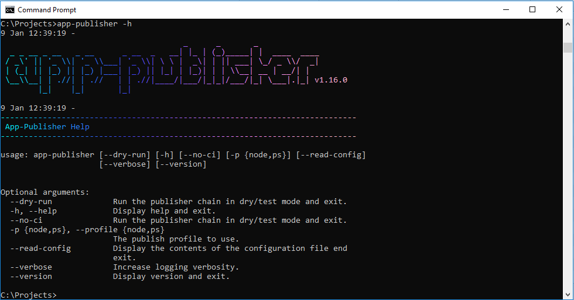

# App Publisher - Release Automation

## Table of Contents

- [App Publisher - Release Automation](#app-publisher---release-automation
  - [Table of Contents](#table-of-contents)
  - [Description](#description)
  - [Requirements](#requirements)
  - [Installation](#installation)
  - [Commit Messages](#commit-messages)
  - [Usage](#usage)
    - [Usage - Configuration File](#usage---configuration-file)
    - [Usage - Example Configuration File](#usage---example-configuration-file)
  - [Configuration Parameters](#configuration-parameters)
    - [branch](#branch)
    - [bugs](#bugs)
    - [buildCommand](#buildcommand)
    - [changelogFile](#changelogfile)
    - [deployCommand](#deploycommand)
    - [distRelease](#distrelease)
    - [distReleasePath](#distreleasepath)
    - [dryRun](#dryrun)
    - [dryRunVcRevert](#dryrunvcrevert)
    - [emailHrefs](#emailhrefs)
    - [emailNotification](#emailnotification)
    - [emailPort](#emailport)
    - [emailRecip](#emailrecip)
    - [emailServer](#emailserver)
    - [emailSender](#emailsender)
    - [pathToDist](#pathtodist)
    - [postBuildCommand](#postbuildcommand)
    - [postReleaseCommand](#postreleasecommand)
    - [projectName](#projectname)
    - [skipVersionEdits](#skipversionedits)
    - [textEditor](#texteditor)
  - [How the Next Version is Determined](#how-the-next-version-is-determined)
  - [MantisBT Token](#mantisbt-token)
  - [NPM Token](#npm-token)
  - [Running Outside of the Code Package Environment](#running-outside-of-the-code-package-environment)

## Description

This package provides a semantic version style release mechanism as an option to the popular semantic-release modules.

The steps performed during an app-publisher run are:

- Automatically determine next version from commit messages since last version. See the section on determining the next version [here](#Determining-the-Next-Version).
- Auto-populate history text file and/or changelog markdown with commit messages since last version
- Update all versioned files with new version
- Run application specific build scripts
- Build installer
- Upload distribution files to network drive
- Build and publish NPM package
- Build and publish Nuget package
- Run application specific deploy scripts
- Check all modifications into VC
- Tag with new version in VC
- Upload a MantisBT or GitHub release including changelog and file assets
- Send release email

## Requirements

- Windows 10
- Powershell 5
- Code Package Environment (Optional)

## Installation

To install app-publisher globally for convenience, run the following command:

    npm install -g @perryjohnson/app-publisher

To install locally per project, run the following command from the directory containing the projects package.json file:

    npm install @perryjohnson/app-publisher

Currently, the publish is ran from a powershell script.  You will need to set the powershell execution policy with the following command if you have not already done so on your computer at some point in the past:

    Set-ExecutionPolicy -ExecutionPolicy RemoteSigned -Scope LocalMachine

After the port to JS, this no longer be required.

## Commit Messages

Commit message format is an integral part of the App Publisher release process.

See the standards [here](https://app1.development.pjats.com/doc/developernotes.md#Commit-Messages).  See the GitHub standards [here](https://gist.github.com/stephenparish/9941e89d80e2bc58a153).

Commit messages should be made in the following format:

    subject(scope): short_message

    body

    footer

The "subject" should be one of the following:

- build
- chore
- ci
- docs
- feat
- featmin
- featmaj
- fix
- perf
- project
- refactor
- style
- visual

The "scope" can be anything specific to the commit change, for example:

    docs(readme): update info on commit messages

It may also be ommitted, for example:

    chore: update dependency for app-publisher to latest version

The subject "short_message" should be a short description of the change, preferably less than 160 characters.

The "body" should give a detailed explanation of the change.

The "footer" should give a detailed explanation of what the change fixes, or how it affects the application.

To reference issues from commit messages, use the "refs", "fixes", or "closes" tag anywhere in the commit message, for example:

    fix(User Management): the "add user" button doesnt work when selecting the option "clerk"

    A typo was preventing the end user from being able to create a clerk type user.

    Users hould nw be able to create a clerk type user successfully.
    Note that non-administrators do not have access to this functionality.
    [fixes #142]

Including the [fixes #142] (or [closes #142]) tag in the footer will link the issue to the commit, auto-close the issue, remove any relevant tags from the issue, and add the "fixed" tag to the closed issue.

    feat(Job Administration): add support for the "modify status" action

    The action "Modify Status" in the Search Results tabs of Job Administration is now functional.

    Note that the list of statuses that the jobs may be changed to will be reduced in the next release.
    [refs #142]

Including the [refs #142] tag anywhere in the commit message will link the issue to the commit.

The commit messages will be used in the generation of the history and changelog files when running app-publisher.

References:

- [Perry Johnson Commit Message Standards](https://app1.development.pjats.com/doc/developernotes.md#Commit-Messages)
- [GitHub Commit Message Standards](https://gist.github.com/stephenparish/9941e89d80e2bc58a153)
- [Angular Commenting Standards Updated](https://github.com/angular/angular/blob/master/CONTRIBUTING.md#type)

## Usage

App-Publisher can be run from the command line or in Visual Studio Code using the [Task Explorer](https://marketplace.visualstudio.com/items?itemName=spmeesseman.vscode-taskexplorer) Extension.  The Task Explorer extension will automatically detect .publishrc.json files in a project, and display the tasks within an app-publisher node.

From the command line, the following command can be executed:

    cd project_root
    node app-publisher -p ps --no-ci

A dry run can also be performed with the --dry-run option:

    cd project_root
    node app-publisher -p ps --no-ci --dry-run

### Usage - Configuration File

The .publishrc.json file can be used to define the configuration parameters, defined below.

|Parameter Name|Description|Type|Supported Values|Default Value|
|-|-|-|-|-|
|projectName|Name of the project.  This must macth the version control repository project name|string|||
|buildCommand|An array of commands to run once versions have been updated in version files (i.e. package.json,history.txt, assemblyinfo.cs, etc)|array(string)|||
|deployCommand|An array of commands to run once builds are completed and iternal releases are made|array(string)|||
|distRelease|Perform a network/filesystem directory release|enum|Y, N, Yes, No|N|
|distReleasePath|The filesystem path to be used in a network/filesystem release|string|||
|distDocPath|The filesystem path to be used for pdf documentation in a network/filesystem release|string|||
|dryRun|In dry run mode, the following holds true: Installer is not released/published Email notification will be sent only to TESTEMAILRECIP Commit package/build file changes are not made, version tag is not made. Some local files may be changed in test mode (i.e. updated version numbers in build and package files). These changes should be reverted to original state via SCM|string|||
|dryRunVcRevert|Revert all touched files in version control after a dry run|enum|Y, N, Yes, No|Y|
|emailNotification|Send a release notification email when the publish run finishes successfully|enum|Y, N, Yes, No|N|
|emailServer|The smtp mail server address|string|||
|emailRecip|The email address to use to send a release notification email|string|||
|emailSender|The email address to use as the sender when sending a release notification email|string|||
|emailMode|The smtp email mode to use when sending a release notification email|enum|unencrypted, ssl, tls|unencrypted|
|emailHrefs|An array of additional links to be displayed in a release notification email|array(string)|||
|githubRelease|Perform a GitHub release|enum|Y, N, Yes, No|N|
|githubAssets|An array of file assets to upload with a GitHub release|array(string)|||
|githubUser|The GitHub username to use when uploading a GitHub release|string|||
|interactive|Interactive (prompts for version after extracting what we think should be the next version)|enum|Y, N, Yes, No|N|
|historyFile|The location of this history file, can be a relative or full path|string|||
|historyLineLen|The max line length of the history file|integer|0-250|80|
|historyHdrFile|The location of this history header file, can be a relative or full path|string|||
|mantisbtRelease|Perform a MantisBT release. Note that the `Releases` plugin must be installed on the MantisBT instance to perform a Mantis Release. See the [MantisBT Token](#MantisBT-Token) section for additional information on performing a MantisBT release.|enum|Y, N, Yes, No|N|
|mantisbtApiToken|An array of MantisBT user API tokens to use when uploading a release(s)|array(string)|||
|mantisbtAssets|An array of file assets to upload with a MantisBT release|array(string)|||
|mantisbtProject|The MantisBT project name, if different then `projectName`|string|||
|mantisbtUrl|An array of urls to upload a MantisBT release to|array(string)|||
|npmRelease|Build an npm release|enum|Y, N, Yes, No|N|
|npmScope|The scope of the npm package, empty if none|string|||
|nugetRelease|Build a Nuget release|enum|Y, N, Yes, No|N|
|pathToRoot|It is assumed that installer build files are in PATHTOROOT\install. It is also assumed that the legacy CreateInstall.xml and Deploy.xml files are located in PATHTOROOT\install. A relative or full path that will equate to the project root as seen from the  script's location. For example, if this script is in PROJECTDIR\script, then the rel path to root would be "..". If the script is in PROJECTDIR\install\script, then the rel path to root would be "..\\..". The value should be relative to the script dir, dont use a full path as this will not share across users well keeping project files in different directories|string||.|
|pathToMainRoot|This in most cases sould be an empty string if the project is the 'main' project. If a sub-project exists within a main project in SVN, then this needs to be set to the relative directory to the main project root, as seen from the sub-project root. Note this should be where the '.svn' folder resides|string|||
|pathToDist|Path to DIST should be relative to PATHTOROOT. This in most cases sould be an empty string if the project is the 'main' project. If a sub-project exists within a main project in SVN, then this needs to be set to the relative directory to the project path, as seen from the main project root|string|||
|pathPreRoot|The main project root is app-publisher. In the case of each of these projects, SVNPREPATH should be set to app\fpc, app\ui, or app\svr, for each specific sub-project. This mainly is be used for SVN commands which need to be ran in the directory containing the .svn folder|string|||
|postBuildCommand|An array of commands to run once builds are completed|array(string)|||
|repo|The version control path to the project, including branch part if using svn Note this value is required for projects that do not have a package.json with the repository parameter set|string|||
|repoType|The type of version control repository of the project|enum|git, svn|svn|
|skipCommit||enum|Y, N, Yes, No|N|
|skipDeployPush|Skip uploading installer to network release folder Primarily used for releasing from hom office where two datacenters cannot be reached at the same time, in this case the installer files are manually copied)|enum|Y, N, Yes, No|N|
|vcTag|Whether or not to tag the version in version control Note this is not recommended to be turned off|enum|Y, N, Yes, No|Y|
|versionFiles|An array of additional files that should have a version bump (text replacement of old to new version)|array(string)|||
|versionText|The text tag to use in the history file for preceding the version number|enum|Version, Build, Release|Version|
|writeLog|Whether or not to write stdout to log file|enum|Y, N, Yes, No|N|

### Usage - Example Configuration File

To configure app-publisher per project, create a .publishrc.json file in the root project directory.

Environment variables can be used and expanded at runtime using the following syntax:

    ${ENVIRONMENT_VARIABLE_NAME}

An example .publishrc.json file:

    {
        "projectName":       "app-publisher",
        "branch":            "trunk",
        "bugs":              "",
        "buildCommand": [
            "npm run build",
            "${CODE_HOME}\\nsis\\makensis.exe install\\installer-x86.nsi"
        ],
        "changelogFile":     "CHANGELOG.md",
        "deployCommand":     "",
        "distRelease":       "Y",
        "distReleasePath":   "\\\\network_machine\\share_name\\releases",
        "distDocPath":       "",
        "dryRunVcRevert":    "Y",
        "emailNotification": "Y",
        "emailServer":       "smtp.domain.com",
        "emailRecip":        "release@domain.com",
        "emailSender":       "build@domain.com",
        "emailHrefs":        [],
        "emailMode":         "",
        "githubRelease":     "Y",
        "githubAssets": [
            "install\\dist\\app-publisher.tgz",
            "install\\dist\\App-Publisher_32bit.exe"
        ],
        "githubUser":        "spmeesseman",
        "historyFile":       "doc\\history.txt",
        "historyHdrFile":    "install\\history-hdr.txt",
        "historyLineLen":    80,
        "historyHref":       "",
        "homePage":          "",
        "interactive":       "N",
        "mantisbtRelease":   "Y",
        "mantisbtApiToken":  "${MANTISBT_API_TOKEN}",
        "mantisbtUrl":       "https://my.domain.com/mantisbt",
        "mantisbtAssets": [
            "install\\dist\\history.txt|History File",
            "install\\dist\\app-publisher.tgz|NPM Tarball",
            "install\\dist\\App-Publisher_32bit.exe|Windows Installer"
        ]
        "npmPackDist":       "N",
        "npmRegistry":       "",
        "npmRelease":        "Y",
        "npmScope":          "",
        "nugetRelease":      "N",
        "pathToDist":        "install\\dist",
        "pathtoRoot":        ".",
        "pathtoMainRoot":    "",
        "pathPreRoot":       "",
        "postBuildCommand":  "",
        "repoType":          "svn",
        "repo":              "",
        "skipCommit":        "N",
        "skipDeployPush":    "N",
        "testEmailRecip":    "myname@domain.com",
        "textEditor":        "notepad",
        "vcTag":             "Y",
        "vcTagPrefix":       "",
        "versionFiles": [
            "install\\installer-x86.nsi"
        ],
        "versionText":       "Version",
        "writeLog":          "N"
    }

## Configuration Parameters

### branch

The version control branch to perform commit checks and version tagging on.  This can be left blank if specified in package.json.

For Subversion, the default is **trunk**, for Git, the default is **master**.

### bugs

The URL of the website where bugs, issues, and feature requests should be reported.  This can be left blank if specified in package.json.

### buildCommand

A command, or an array of comands, that are to be ran once all of the versions have been updated and changelog finalized.  This can be used to build the application, installer, etc.

### changelogFile

The path to the markdown changelog file, if it is kept.  Leaving this config blank will skip processing of marked down changelog file.

### deployCommand

A command, or an array of comands, that are to be ran before any releases (to MantisBT, GitHub, Directory Release, NPM Release, Nuget Release, etc) are made.

### distRelease

Will be reanmed to **directoryRelease** in future version.  Setting this flag to **Y** will perform a "directory release" to the directory specified in the [distReleasePath](#distReleasePath) config.  All files located in the directory specified by the [pathToDist](#pathToDist) config will be copied to the destination directory.

### distReleasePath

TODO

### dryRun

A dry run can be performed to test the publish run before it is ran "live".  Note that a dry run will automatically set the [skipVersionEdits](#skipVersionEdits) flag to **N**.

### dryRunVcRevert

Set this flag to **N** if you do not want the changes performed on files during a dry run to be reverted back their oiriginal content.

The default value is **Y**.

### emailHrefs

A link, or an array of links, to display in the release notification email.  Note that the [emailNotification](#emailNotification) flag must be set or this config has no effect.

The links can also specify a row label and a link label, for example:

    "emailHrefs": [
        "https://my.domin.com/svn/web/filedetails.php?repname=pja&path=%2Fapp-publisher%2Ftrunk%2FREADME.md&usemime=1|ReadMe File|Readme File - WebSVN",
        "https://my.domin.com//projects/set_project.php?project=app-publisher&make_default=no&ref=roadmap_page.php|Project Roadmap|Roadmap - Projects Board",
        "https://my.domin.com//projects/set_project.php?project=app-publisher&make_default=no&ref=changelog_page.php|Project Changelog|Changelog - Projects Board"
    ]

This config would be displayed in a notification email like so, where the 2nd item in each row is the actual link to the specified url:

    ReadMe File            Readme File - WebSVN
    Project Roadmap        Roadmap - Projects Board
    Project Changelog      Changelog - Projects Board

### emailNotification

Set this flag to **Y** to send a release notification email when the publish run has completed.

Default is **N**.

### emailPort

The port that the email server specified by [emailServer](#emailServer) listens on.

Default is **25**.

### emailRecip

The email address, or an array of email addresses, that the release notification email should be sent to.  Note that the [emailNotification](#emailNotification) flag must be set or this config has no effect.

### emailServer

The hostname or ip address of the email server to be used to send release notification emails.  Note that the [emailNotification](#emailNotification) flag must be set or this config has no effect.

### emailSender

The email address, or an array of email addresses, that the release notification email should be sent from.  Note that the [emailNotification](#emailNotification) flag must be set or this config has no effect.

### pathToDist

TODO

### postBuildCommand

A command, or an array of comands, that are to be ran once all of the builds have been made.  This can be used to clean up any temporary build files that the build scripts do not, adding additional files to be checked in to source control with the version tagging, etc.  These commands are run before any releases (to MantisBT, GitHub, Directory Release, NPM Release, Nuget Release, etc) are made.

### postReleaseCommand

A command, or an array of comands, that are to be ran once all of the releases (to MantisBT, GitHub, Directory Release, NPM Release, Nuget Release, etc) have been made.  These commands are ran right before the publish run has completed.

### projectName

The name of the project.  This hould matchthe project name in version control.

### skipVersionEdits

This flag can be set to **Y** to skip the display of the changed version files in the editor specified by the [textEditor](#textEditor) config.  Note that setting the [dryRun](#dryRun) flag will override this config and automatically set the value to **N**.

### textEditor

Specify the application to be used to open text based version files and files that need to be edited during the publish run.  Defaults to **notepad**.

## How the Next Version is Determined

The next version is determined depnding on the versioning system the application uses.

If a package.json exists in the project directory:

1. Current version is read from package.json
2. Semver is user to validate the current version
3. Semver is used to increment the version

If a history text file is defined in .publishrc.json:

1. Current version is read from the defined history text file
2. Determine if project uses semantic (x.y.z) or incremental versioning (x)
3. If semantic, use Semver is user to validate the current version
4. If semantic, Semver is used to increment the version, if incremental, the version is simply incre,ented by one

In the case where Semver is used to calculate the next version, the commit messages are examined to determine the next version level.  See the standards [here](https://app1.development.pjats.com/doc/developernotes.md#Commit-Messages).

In the case where the current version canot be read in order to determine the next, the publish run halts with an error.

TODO - Check version control tags for most recent/current version as an additional method of determing current version (the semantic-release module from which this module was conceptualized uses this method).

## MantisBT Token

A MantsBT release requires the MANTISBT_API_TOKEN to be set in the system environment.  To create a MantisBT token, perform the following steps:

1. Log into the MantisBT website
2. Go to User Preferences
3. Select the `Tokens` tab
4. Name the token `RESTAPI`
5. Click `Create`.
6. Copy the displayed token
7. Create a system environment variable named `MANTISBT_API_TOKEN`, where the token is it's value.

## NPM Token

An NPM release requires the PJ_NPM_TOKEN or NPM_TOKEN to be set in the system environment.  To create a PJ NPM token, perform the following steps:

To create an npm user if you dont have one, run the following command and follow the prompts:

    $ npm adduser --registry=npm.development.pjats.com --scope=@perryjohnson

After a period of time, the session token created with this command will expire.  When the token expires, run the login command:

    $ npm login --registry=npm.development.pjats.com --scope=@perryjohnson

For more details, see the [Internal NPM Registry](https://app1.development.pjats.com/doc/developernotes.md#Internal-NPM-Registry) section of the Perry Johnson Developer Notes document.

## Running Outside of the Code Package Environment

To run App-Publisher, nodejs and npm are required.  These are by default installed with the *Code Package* installer.

To use App-Publisher without the *Code Package* environment, install NodeJS using the following steps:

1. [Download NodeJS](https://github.com/spmeesseman/code-package/blob/master/src/nodejs/nodejs.zip?raw=true)
2. Unzip the zipball to a directory on your hard drive, for example `c:\nodejs`
3. Add the unzipped directory's location to the SYSTEM PATH.

The download link for NodeJS above installs the version of NodeJS and NPM included with the *Code Package* install and is a simple zip based folder install.  To download the latest version or a Windows installer, visit the NodeJS website.

With NodeJS and NPM installed, open a command line terminal and install App-Publisher globally using the command:

    $ npm install -g @perryjohnson/app-publisher`

Note that to install the package with the above command, you must login to the registry first as described in the [previous section](#npm-token).

To use App-Publisher, open a command line and navigate to the project directory containing the .publishrc.json file.

To see the list of available command line options, run the following command:

    app-publisher -h

For a dry run, run the following command:

    app-publisher -p ps --no-ci --dry-run
For a production release, run the following command:

    app-publisher -p ps --no-ci

